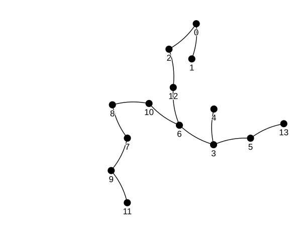

# User Guide

## Introduction

Amoebas are graphs that arise naturally in the study of a group action. The action consists of moving an existing edge of the graph into an available position in such a way that the graph remains isomorphic.

!!! abstract "Theoretical background (see [\[3\]](ref.md) for details)"
    Let $G$ be a graph of order $n$, $e$ an edge of $G$ and $f$ an edge of the complement of $G$. Suppose that $\sigma$ is a permutation of the vertex labels of $G$.

      1. We use the notation $\sigma : (e\to f)$ and call it a *feasible edge replacement* ($\operatorname{fer}$, for short) to abbreviate the fact that $\sigma$ is an isomorphism from $G$ to $G-e+f$. If $\sigma\in\operatorname{Aut}(G)$, we simply write $\sigma : (\emptyset\to\emptyset)$.
      2. The group generated by all $\sigma$ in some $\operatorname{fer}$ (including the automorphisms) is denoted by $\operatorname{Fer}(G)$.
      3. We say a graph is a *local amoeba* if it can be transformed into any isomorphic copy of itself on the same vertex set by a sequence of $\operatorname{fer}$ objects. Algebraically, $G$ is a local amoeba if and only if $\operatorname{Fer}(G)$ is the symmetric group of order $n$. $G$ is a *global amoeba* if $G$ plus an isolated vertex is a local amoeba.

## Classes and Algorithms

### The `Feasible_edge_replacement` class

| Attribute/Method      | Description                          |
| ----------- | ------------------------------------ |
|`.sequence`|The list of indidivual `fer` objects.|
|`.seq_perm`|Associated `sympy.combinatorics.permutations.Permutation` object.|
|`Feasible_edge_replacement(old_edge, new_edge, permutation)`|Create a $\operatorname{fer}$ chain of a single edge-replacement corresponding to the given permutation as a `sympy.combinatorics.permutations.Permutation`. Alternatively, the constructor calls an internal subclass to produce a sequence of indivual edge-replacements, but in practice this will not get much use.|
|`fer + n`|Shifts all labels in the chain of `fer` by the integer `n`.|
|`.tex`|Outputs a $\LaTeX$ string for use in animations or math typesetting.|
|`.isTrivial`|Returns `#!python True` if the `fer` objects corresponds to an automorphism.|
|`fer1 * fer2`|Concatenates two chains by multiplying the permutations and correctly updating the labels on the chain of edges. Automatically shortens the chain when trivial replacements are consecutive (e.g., when the same edge gets moved back and forth).|

!!! info

    The class has no connection to any graph objects, meaning all definitions are internally algebraic. Methods are defined in the framework to verify if the `fer` objects correspond to given graphs.

### The `Fer_group` class

The constructor will either compute the group using the `FerGroup` method or, if passed a valid `encoded` parameter, will invoke the `Fer_G.FerGroup_decoder`. Details on why these methods work will be included in a forthcoming research paper.

| Attribute/Method      | Description                          |
| ----------- | ------------------------------------ |
|`Fer_group(colored_graph, encoded=None)`|`colored_graph` must be a `NetworkX` Graph object, whose nodes may have the optional `color` attribute, in which case the $\operatorname{Fer}_c$ subgroup is correctly computed. If passed the `encoded` parameter, the constructor efficiently finds the `fer` generators from the corresponding permutations.|
|`.generators`| List of `sympy.combinatorics.PermutationGroup` object generators  |
|`.group`| `sympy.combinatorics.PermutationGroup` object associated to the $\operatorname{Fer}$ group. |
|`.automorphism`| List of `fer` objects that are automorphisms |
|`.non_aut`| List of `fer` objects that are not automorphisms |
|`.encode()`| Produces a valid `encoded` parameter with which the object can be efficiently recovered by the constructor.|

!!! info "Caching"
    Most attributes are *cached properties*, and thus must only be computed once, and are then remembered forever.

!!! bug "Colored graph"

    Graphs with the `node.color` attribute correctly produce a valid `Fer_group` but not all features might be available in this case. Please report any bugs on the tracker.

## Database Integration

The author has computed the $\operatorname{Fer}$ group generators of all amoeba graphs of order 1 through 10 and all amoeba trees of order 22 or less. There are 51'735 graphs, all pairwise isomorphic. These are indexed and stored as a 259MB `SQL` database freely available for download on this [Google Drive](https://drive.google.com/file/d/1D8tSlJNjp3q9ghrYdePF0Xui86J0MYZe/view).

### Table structure

``` sql
graphs(
  id            INTEGER PRIMARY KEY,
  graph6        TEXT    NOT NULL,
  iso_invariant TEXT    NOT NULL,
  num_nodes     INTEGER NOT NULL,
  num_edges     INTEGER NOT NULL,
  is_connected  BOOLEAN,
  is_tree       BOOLEAN,
  is_local      BOOLEAN,
  is_global     BOOLEAN,
  fer_group     BLOB,
  UNIQUE(graph6))
```

| Key         | Description                          |
| -------------- | ------------------------------------ |
|`graph6`| See [here](https://users.cecs.anu.edu.au/~bdm/data/formats.html) for details on how this format is handled.|
|`iso_invariant`| Table index consisting of a concatenation of two graph isomorphism invariants: the degree sequence and the triangle sequence of the graph (inspired by [`nx.fast_could_could_be_isomorphic`](https://networkx.org/documentation/stable/reference/algorithms/generated/networkx.algorithms.isomorphism.fast_could_be_isomorphic.html)) that are computed and verified efficiently. This makes finding an isomorphic copy of a given graph inside the database extremely fast. |
|`num_nodes`|The number of nodes.|
|`num_edges`|The number of edges.|
|`is_connected`|If the graph is connected.|
|`is_tree`|If the graph is connected and acyclic.|
|`is_local`|If the graph is a local amoeba.|
|`is_global`|If the graph is a global amoeba.|
|`fer_group`| Serialized `pickle` file encoding the generators. Finding these is by far the most expensive computation, and thus caching these values is the main purpose of the database. |

!!! warning "Warning"

    Despite what some sources (e.g. ChatGPT) claim, graph6 is **not** a graph canonization.

### Database creation:

The database can be created from scratch by either iterating over all pairwise non-isomorphic graphs generated in [`nauty`](https://users.cecs.anu.edu.au/~bdm/nauty/) and computing their $\operatorname{Fer}$ groups, or sifting through a [database](https://users.cecs.anu.edu.au/~bdm/data/) such as the one created by Brendan McKay. Something similar was done in [this repository](https://github.com/MarcosLaffitte/Amoebas) by Marcos Laffitte, who found all amoeba graphs in the same range, as part of his Masters dissertation, by counting the sizes of the Fer groups without generating them or storing the generators. The program in `database_fetcher.ipynb` allows all three options to re-create the database, but defaults to the fastest, namely the latter.

The program in `database_maker.ipynb` fills in the missing data points for the database. Most importantly, it finds the graph $\operatorname{Fer}$ group generators consisting of a single feasible edge-replacement (which when joined with $\operatorname{Aut}(G)$ generate the entire $\operatorname{Fer}$ group). The parameters can be easily modified to restrict the isomorphism finder to different matching criteria, such as isomorphisms that preserve a fixed coloring on the vertices, for example. The list of generators is compactly encoded into an array and stored for easy and efficient reconstruction of the group object.

### Database queries:

!!! warning
    Ensure that the `graphs.db` file is inside the `\databases\` folder (see the [Installation](install.md) guide for steps to achieve this).

We showcase the usefulness of the database by querying an example answering the theoretical question:

!!! question

    What are, up to isomorphism, all connected global non-local amoebas of 8 to 10 nodes?

=== "SQL"

    ``` sql
    SELECT * FROM graphs WHERE '+
            'is_global = 1 AND '+
         'is_connected = 1 AND '+
             'is_local = 0 AND '+
      'num_nodes BETWEEN 8 AND 10
    ```

=== "Python"

    ``` python
    import sqlite3

    # Connect to database
    conn = sqlite3.connect('databases/graphs.db')
    cursor = conn.cursor()

    # SQL query
    cursor.execute('SELECT * FROM graphs WHERE '+
                            'is_global = 1 AND '+
                         'is_connected = 1 AND '+
                             'is_local = 0 AND '+
                      'num_nodes BETWEEN 8 AND 10')

    # Fetch results
    results = cursor.fetchall()
    conn.close()

    print(f"There are {len(results)} many such graphs.")
    ```

## Hypothesis Testing

!!! info "Work in progress"

## Interactive Visualization and Animation

Animations are powered by the [Manim Community](https://www.manim.community/) and adapted to the spcifics of the framework.

!!! info "Work in progress"

### Interactive plot with gravis

``` python title="Installing gravis"
!pip install gravis
import gravis as gv
v_options = {'show_node_label': True,
              'zoom_factor': 2,
              'many_body_force_strength': -10}
```

