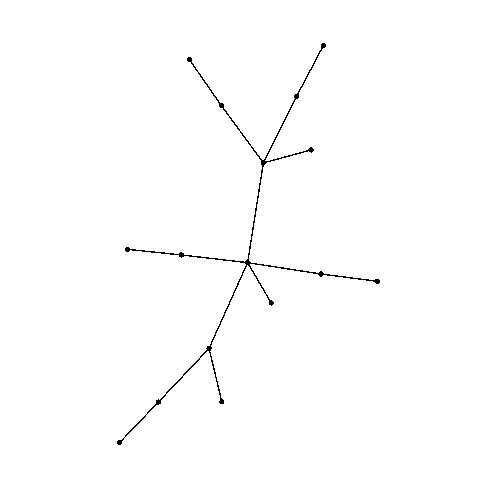
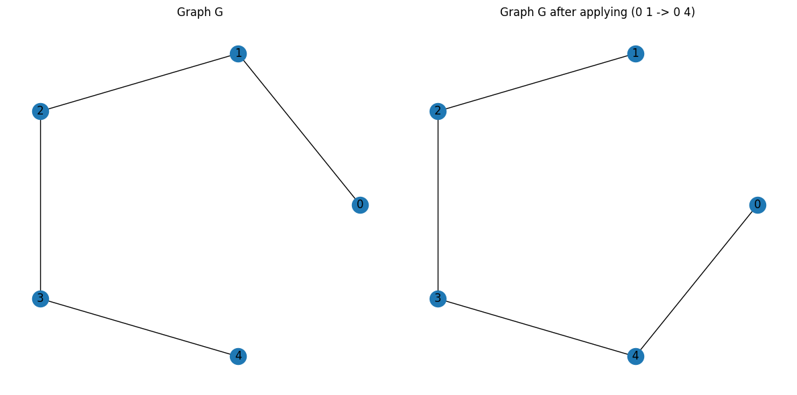

{align=right width="200"}

# Welcome to FerGroup

The comprehensive framework for the study of *Amoeba graphs* and the $\operatorname{Fer}$ group.

---

## Features

<div class="grid cards" markdown>

- **Intuitive isomorphism chains**

    Perform operations like products and label shifts with ease. Automatically shorten chains for readability and efficiency.

- **$\operatorname{Fer}$ group computation**

    Computation of the $\operatorname{Fer}$ group for any graph. Including flexible isomorphism criteria, such as node color constraints.

- **Precomputed amoeba database**

    Automatically queried to avoid recomputation. Offers a foundation for hypothesis testing and statistical analysis.

- **Powerful visualization tools**

    Animate $\operatorname{Fer}$ group actions, including automorphisms. Easily export in any format for presentations and publications.

- **Flexible and extensible design**

    Modify the isomorphism matcher to handle custom constraints (e.g., colored nodes).

- **Cutting-edge algorithms**

    Built-in tools to factor `fer` objects into generators of specific graph families.

</div>

## Introduction

Amoebas are graphs that arise naturally in the study of a particular group action. The action consists of moving an existing edge of the graph into an available position in such a way that the graph remains isomorphic. Below you can find an example with the path on 5 vertices, $P_5$.

!!! abstract "Theoretical background (see [\[3\]](ref.md) for details)"
    Let $G$ be a graph of order $n$, $e$ an edge of $G$ and $f$ an edge of the complement of $G$. Suppose that $\sigma$ is a permutation of the vertex labels of $G$.

      1. We use the notation $\sigma : (e\to f)$ and call it a *feasible edge replacement* ($\operatorname{fer}$, for short) to abbreviate the fact that $\sigma$ is an isomorphism from $G$ to $G-e+f$. If $\sigma\in\operatorname{Aut}(G)$, we simply write $\sigma : (\emptyset\to\emptyset)$.
      2. The group generated by all $\sigma$ in some $\operatorname{fer}$ (including the automorphisms) is denoted by $\operatorname{Fer}(G)$.
      3. We say a graph is a *local amoeba* if it can be transformed into any isomorphic copy of itself on the same vertex set by a sequence of $\operatorname{fer}$ objects. Algebraically, $G$ is a local amoeba if and only if $\operatorname{Fer}(G)$ is the symmetric group of order $n$. $G$ is a *global amoeba* if $G$ plus an isolated vertex is a local amoeba.

## Quick Start

!!! info "Please consult the [User Guide](guide.md) for the complete project documentation."

You can find all below examples already on [Google Colab](https://colab.research.google.com/drive/1Q6RfE8DRJe97FJdhS7nWUwByAoBpXCOk?usp=sharing).

### Installing on Google Colab

``` python title="Quick installation"
!git clone https://github.com/tonamatos/FerGroup.git
%cd FerGroup
from fer_group import Fer_group
```

### Computing the Fer group of a path

``` python
import networkx as nx

# Generate graph and find Fer group
G = nx.path_graph(5)
K = Fer_group(G)
print(K)
```

``` text title="Output"
Automorphism generators
                         (4) : (0 -> 0)
                  (0 4)(1 3) : (0 -> 0)

Non-trivial Fer object generators
                  (1 4)(2 3) : (0 1 -> 0 4)
                    (4)(0 1) : (1 2 -> 0 2)
                  (0 1)(2 4) : (1 2 -> 0 4)
                       (2 4) : (1 2 -> 1 4)
                    (4)(0 2) : (2 3 -> 0 3)
                  (0 2)(3 4) : (2 3 -> 0 4)
                       (3 4) : (2 3 -> 2 4)
                 (0 1 2 3 4) : (3 4 -> 0 4)
```

### Plotting

``` python title="Plotting an edge-replacement"
import matplotlib.pyplot as plt
from Fer_G import edge_replace

# Apply an edge-replacement
H = edge_replace(G, (0, 1), (0, 4))

# Create layout and plot
pos = nx.circular_layout(G)
fig, axes = plt.subplots(1, 2, figsize=(12, 6))

# Draw graphs
nx.draw(G, pos=pos, with_labels=True, ax=axes[0])
axes[0].set_title("Graph G")
nx.draw(H, pos=pos, with_labels=True, ax=axes[1])
axes[1].set_title("Graph G after applying (0 1 -> 0 4)")

# Show plot
plt.tight_layout()
plt.show()
```



### `fer` object manipulation

We can interact with the elements of the $\operatorname{Fer}$ group. These can be defined manually or taken from an existing group, like the one above. We showcase both posibilities.

!!! warning "Multiplication order"

    In this framework, permutations are always multiplied **left to right**, as opposed to most literature on Group Theory.

=== "From an existing group"

    ``` python
    # Take the first two non-automorphism fer objects in K
    fer1 = K.non_aut[0]
    fer2 = K.non_aut[1]

    # Multiplication is left-to-right
    fer3 = fer1*fer2
    print(fer3)
    ```

=== "Manually"

    ``` python
    # Manual definition
    from sympy.combinatorics.permutations import Permutation
    from feasible_edge_replacements import Feasible_edge_replacement as Fer

    # Define the permutations
    p1 = Permutation(1,4)(2,3)
    p2 = Permutation(4)(0,1)

    fer1 = Fer(old_edge={0,1}, new_edge={0,4}, permutation=p1)
    fer2 = Fer(old_edge={1,2}, new_edge={0,2}, permutation=p2)

    # Multiplication is left-to-right
    fer3 = fer1*fer2
    print(fer3)
    ```

``` text title="Output"
                (0 1 4)(2 3) : (0 1 -> 0 4)(3 4 -> 0 3)
```

### Powerful tools at your disposal

!!! tip "FerGroup makes complex information on the group easily available."

``` python
print("Group order:",                 K.group.order())
print("Orbits:",                     *K.group.orbits())
print("Is symmetric?",                K.group.is_symmetric)
print("Is abelian?",                  K.group.is_abelian)
print("Is primitive?",                K.group.is_primitive())
print("Number of automorphisms:", len(K.automorphism))
print("Stabilizer:",                 *K.group.pointwise_stabilizer([0,1,4]))
```

``` text title="Output"
Group order:		     120
Orbits:			         {0, 1, 2, 3, 4}
Is symmetric?		     True
Is abelian?		         False
Is primitive?		     True
Number of automorphisms: 2
Stabilizer:		         (4)(2 3)
```